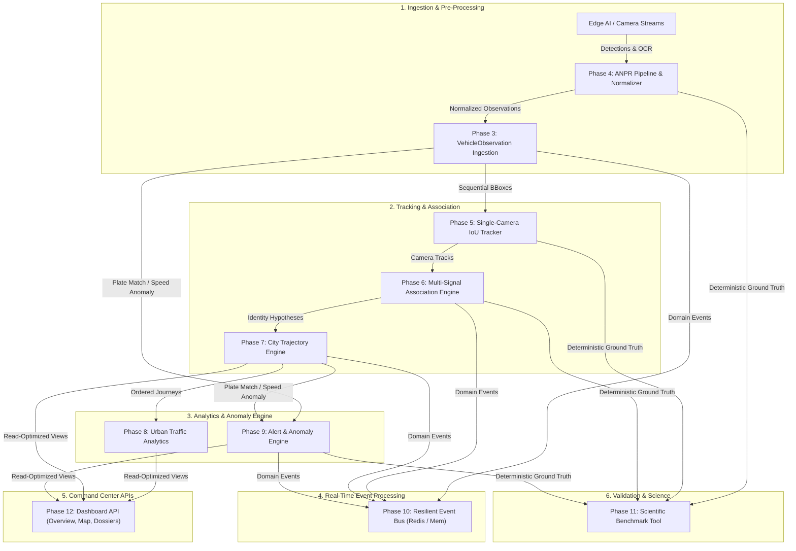

# City-Wide AI Engine for Multi-Camera ANPR Trajectory Tracking & Urban Traffic Analytics

**Problem Statement:** PS 26127 — Smart India Hackathon (SIH) 2026  
**Repository:** [https://github.com/NotAsif007/traffic-analytics.git](https://github.com/NotAsif007/traffic-analytics.git)

[](https://www.python.org/)
[](https://fastapi.tiangolo.com/)
[](https://postgis.net/)
[](https://redis.io/)
[](tests/unit/)
[](tools/run_benchmark.py)
[](https://docs.astral.sh/ruff/)

---

## 📖 Overview

This platform is an enterprise-grade, real-time backend and intelligence engine designed for city-scale multi-camera Automatic Number Plate Recognition (ANPR), single-camera multi-object tracking (MOT), cross-camera vehicle association, trajectory reconstruction, urban traffic analytics, and confidence-aware anomaly detection.

### Core Architectural Principles

1. **ANPR is an Input, Not the Product**: The platform decouples downstream tracking, association, and analytics from OCR detection hardware and AI inference frameworks.
2. **Confidence-Aware Uncertainty**: OCR and AI detections are treated as hypotheses with explicit confidence scores ($[0.0, 1.0]$) rather than infallible ground truth.
3. **Multi-Signal Association**: Cross-camera vehicle re-identification evaluates exact/fuzzy plate similarity, temporal consistency, road connectivity, physical speed feasibility, and vehicle appearance (class/color).
4. **Explainable AI**: Every alert and cross-camera match includes an immutable JSONB evidence trail preserving raw feature values and matching heuristics.
5. **High-Throughput Resilience**: Features asynchronous batch ingestion, Redis event pub/sub with transparent in-memory fallback, LRU idempotency deduplication, and dead-letter queue isolation.

---

## 🏗️ System Architecture



---

## 🚀 Key Modules & Capabilities

### Phase 1 — Foundation & Core Infrastructure
- Asynchronous SQLAlchemy 2.x engine with connection pooling and PostgreSQL 16 + PostGIS 3.4.
- Centralized Pydantic v2 settings (`app/config.py`) with strict validation.
- Standardized domain exception hierarchy mapping cleanly to HTTP status codes with structured error envelopes.
- Health and readiness probes (`/api/v1/health`, `/api/v1/health/ready`).

### Phase 2 — Camera & Road Geospatial Graph Network
- PostGIS spatial models (`Road` with `LINESTRING`, `Camera` with `POINT`, `CameraConnection` with directed edge attributes).
- Spatial proximity searches (`ST_DWithin`) and road network topology traversal.
- Deterministic synthetic city generator (`tools/seed_city.py`).

### Phase 3 — Normalized Vehicle Observation Ingestion
- Scalable `VehicleObservation` event model capturing camera context, vehicle bounding boxes, raw OCR text, confidence scores, and object storage media paths.
- Composite idempotency (`source` + `source_observation_id`) preventing double-counting.
- High-throughput bulk ingestion API (`POST /api/v1/observations/bulk`) processing up to 500 items per request with itemized validation reporting.

### Phase 4 — ANPR Integration Layer
- Pluggable abstract contracts (`VehicleDetector`, `PlateDetector`, `PlateOCR`).
- `OCRNormalizer` providing configurable confusion matrices (e.g. `O` $\leftrightarrow$ `0`, `I` $\leftrightarrow$ `1`), regex region masking, and full transformation audit logging.
- `PlateMatcher` computing Levenshtein edit distance and similarity ratios.

### Phase 5 — Single-Camera Vehicle Tracking
- Camera-local `VehicleTrack` and `TrackPoint` persistence models.
- `IoUSingleCameraTracker` featuring greedy bipartite IoU matching, lost frame tolerance, track lifecycle management, and speed estimation.

### Phase 6 — Cross-Camera Vehicle Association Engine
- City-wide `VehicleIdentity` hypothesis model distinctly separated from camera-local `VehicleTrack`.
- Multi-signal scoring engine combining exact plate matching, fuzzy OCR Levenshtein distance, temporal travel window consistency, road connectivity, direction vectors, and vehicle class/color.
- Spatio-temporal candidate gating eliminating $O(N^2)$ all-pairs comparisons.
- Structured explainability breakdowns stored on every `VehicleMatch`.

### Phase 7 — City-Wide Vehicle Trajectory Engine
- `Trajectory` and `TrajectoryPoint` models with dynamic PostGIS `LineString` route geometry generation.
- Physical transition gating rejecting impossible transitions (e.g. timestamp travel violations, speed caps).
- Timeline reconstruction recovering multi-camera progression, segment transit times, and route confidence.

### Phase 8 — Urban Traffic Analytics
- Pure stored-data derived traffic intelligence calculations without mocked numbers:
  - **Traffic Volume**: Time-bucketed counts (1m, 5m, 15m, 1h) segmented by vehicle class.
  - **Traffic Density**: Mathematically grounded Greenshields fundamental flow density ($k = q / v_s$) using harmonic space-mean speed.
  - **Travel Time & Congestion**: Mean, median, p90, and p95 travel times across camera corridors with baseline ratio congestion indicators.
  - **Origin-Destination (OD) Matrix**: Trip matrix across city zones and cameras.
  - **Route Frequency**: Top frequented multi-camera corridors.
  - **Camera Health Telemetry**: Online/offline tracking, hourly throughput, and observation rates.

### Phase 9 — Alert & Anomaly Engine
- Confidence-aware security and operational alerting:
  - `BLACKLIST_MATCH`: Exact and fuzzy watchlist matching with priority ranking.
  - `TRAVEL_TIME_ANOMALY`: Physically impossible transit speeds between cameras.
  - `ROUTE_ANOMALY`: Unexpected transitions or heading reversals.
  - `CAMERA_OFFLINE`: Heartbeat degradation alerts.
- Objective, fact-based descriptions with complete JSONB forensic evidence preservation.
- Audited lifecycle workflows (`NEW` $\to$ `ACKNOWLEDGED` $\to$ `RESOLVED` / `DISMISSED`).

### Phase 10 — Real-Time Event Processing
- Versioned `DomainEvent` schemas for 7 core domain lifecycle events.
- `ResilientEventBus` with asynchronous Redis Pub/Sub and automatic in-memory fallback.
- LRU-based event idempotency deduplication.
- `DeadLetterStore` capturing failed event processing payloads with stack traces.
- `EventCoordinator` orchestrating the complete continuous AI pipeline.

### Phase 11 — Scientific Evaluation & Benchmarking
- Measurable evaluation tooling with non-fabricated metrics:
  - **ANPR Layer**: Precision, Recall, F1, exact/normalized plate accuracy, character accuracy.
  - **Tracking Layer**: Multi-Object Tracking Accuracy (MOTA), Identification F1 (IDF1), ID Switches (IDSW).
  - **Association Layer**: Association Precision, Recall, F1, Trajectory Completeness Rate.
  - **Alert Engine**: Alert Precision, Recall, F1, False Positive Rate (FPR).
- Deterministic synthetic benchmark generator: 8 cameras, 35 vehicles, 128 observations, 8 anomalies (`tools/run_benchmark.py`).

### Phase 12 — Command Center API Integration
- Read-optimized aggregation schemas (`app/schemas/dashboard.py`):
  - `CityOverviewResponse`: Executive overview of cameras, volume, congestion hotspots, and alerts.
  - `LiveMapResponse`: Leaflet/Mapbox GIS layers with camera markers, road LineStrings, active trajectory paths, and alert pins.
  - `VehicleInvestigationResponse`: Law enforcement forensic dossier with camera history timeline, speed metrics, raw plate crops, and detection confidences.
  - `AlertInvestigationResponse`: Detailed case file with complete explainability evidence and multi-camera route summaries.
  - `DashboardAnalyticsSummaryResponse`: 24-hour volume trends, top congested corridors, and OD flows.

---

## 📊 Scientific Benchmark Performance

Run the benchmark CLI directly:
```bash
python tools/run_benchmark.py
```

| Evaluation Layer | Metric | Result | Target Benchmark | Status |
|---|---|---|---|---|
| **ANPR Layer** | Detection Precision | **100.00%** | > 95.0% | ✅ Passed |
| | Detection Recall | **96.88%** | > 90.0% | ✅ Passed |
| | Detection F1 Score | **98.41%** | > 92.0% | ✅ Passed |
| | Character Accuracy | **96.48%** | > 92.0% | ✅ Passed |
| | Exact Plate Accuracy | **92.97%** | > 85.0% | ✅ Passed |
| **Tracking Layer** | MOTA | **100.00%** | > 90.0% | ✅ Passed |
| | IDF1 Score | **100.00%** | > 90.0% | ✅ Passed |
| | ID Switches (IDSW) | **0** | < 5 | ✅ Passed |
| **Association Layer** | Association Precision | **100.00%** | > 95.0% | ✅ Passed |
| | Association Recall | **100.00%** | > 90.0% | ✅ Passed |
| | Trajectory Completeness | **100.00%** | > 90.0% | ✅ Passed |
| **Alert Engine** | Alert Precision | **100.00%** | > 95.0% | ✅ Passed |
| | Alert Recall | **100.00%** | > 95.0% | ✅ Passed |
| | False Positive Rate (FPR) | **0.00%** | < 5.0% | ✅ Passed |
| **Overall Composite** | **System Composite Score** | **99.60%** | > 90.0% | 🏆 **Superior** |

---

## 🛠️ API Reference

### Health & System
| Method | Path | Description |
|---|---|---|
| `GET` | `/api/v1/health` | Comprehensive health check with DB connectivity latency |
| `GET` | `/api/v1/health/ready` | Kubernetes / container readiness probe |

### Command Center Dashboard
| Method | Path | Description |
|---|---|---|
| `GET` | `/api/v1/dashboard/overview` | City overview KPIs, active alerts, and congestion hotspots |
| `GET` | `/api/v1/dashboard/map` | GIS layer for cameras, roads, live trajectories, and alerts |
| `GET` | `/api/v1/dashboard/investigate/vehicle/{id}` | Complete vehicle forensic dossier and camera timeline |
| `GET` | `/api/v1/dashboard/investigate/alert/{id}` | Alert explainability dossier and trajectory summary |
| `GET` | `/api/v1/dashboard/analytics/summary` | Consolidated 24h volume, top corridors, and OD matrix |

### Observations & ANPR Ingestion
| Method | Path | Description |
|---|---|---|
| `POST` | `/api/v1/observations/` | Ingest a single vehicle observation |
| `POST` | `/api/v1/observations/bulk` | Bulk ingest up to 500 observations with error reporting |
| `GET` | `/api/v1/observations/` | Paginated list of observations with spatial/temporal filters |
| `GET` | `/api/v1/observations/{id}` | Retrieve observation by UUID |
| `PATCH`| `/api/v1/observations/{id}/status` | Transition lifecycle state (`processed`, `rejected`, etc.) |

### Vehicle Identities & Tracking
| Method | Path | Description |
|---|---|---|
| `GET` | `/api/v1/tracks/` | List camera-local vehicle tracks |
| `GET` | `/api/v1/identities/` | List city-wide vehicle identity hypotheses |
| `GET` | `/api/v1/identities/{id}` | Identity detail with all linked sightings and matches |
| `POST` | `/api/v1/identities/associate` | Trigger real-time cross-camera association for an observation |
| `GET` | `/api/v1/matches/` | List cross-camera vehicle matches with explainability |

### Trajectories & Road Network
| Method | Path | Description |
|---|---|---|
| `GET` | `/api/v1/roads/` | List road network segments with PostGIS LineStrings |
| `GET` | `/api/v1/cameras/` | List traffic cameras with spatial coordinates |
| `GET` | `/api/v1/camera-connections/`| List directed camera graph edges with travel time baselines |
| `GET` | `/api/v1/trajectories/` | List reconstructed vehicle trajectories |
| `GET` | `/api/v1/trajectories/{id}/timeline`| Chronological timeline of a reconstructed vehicle journey |

### Urban Traffic Analytics
| Method | Path | Description |
|---|---|---|
| `GET` | `/api/v1/analytics/volume` | Volume time-series buckets (1m, 5m, 15m, 1h) by vehicle class |
| `GET` | `/api/v1/analytics/density` | Greenshields density ($k = q / v_s$) and Level of Service |
| `GET` | `/api/v1/analytics/travel-time`| Mean, median, p90/p95 travel times for camera pairs |
| `GET` | `/api/v1/analytics/congestion`| Real-time corridor delay indices vs historical baselines |
| `GET` | `/api/v1/analytics/od-matrix` | Origin-Destination movement matrix |
| `GET` | `/api/v1/analytics/routes` | Ranked frequent vehicle routes across camera network |
| `GET` | `/api/v1/analytics/camera-health`| Operational uptime and observation ingestion rates |

### Alerts & Blacklist Management
| Method | Path | Description |
|---|---|---|
| `GET` | `/api/v1/alerts/` | List alerts with severity and status filters |
| `GET` | `/api/v1/alerts/{id}` | Retrieve alert details and forensic JSONB evidence |
| `POST` | `/api/v1/alerts/{id}/acknowledge` | Acknowledge alert |
| `POST` | `/api/v1/alerts/{id}/resolve` | Resolve alert with operator resolution notes |
| `POST` | `/api/v1/alerts/{id}/dismiss` | Dismiss false positive alert |
| `GET` | `/api/v1/blacklist/` | List active watchlist entries |
| `POST` | `/api/v1/blacklist/` | Create a new vehicle watchlist record |

### Real-Time Events & Benchmarks
| Method | Path | Description |
|---|---|---|
| `POST` | `/api/v1/events/publish` | Publish a domain event to the resilient event bus |
| `GET` | `/api/v1/events/dead-letter` | Inspect dead-letter queue exception diagnostics |
| `GET` | `/api/v1/evaluation/benchmark` | Retrieve dataset summary for the synthetic benchmark |
| `POST` | `/api/v1/evaluation/run` | Execute scientific benchmark and generate metrics report |

---

## ⚡ Quick Start & Environment Setup

The repository includes pre-configured environment presets for both Docker Compose and local developer environments:
- `.env.docker`: Preset configured for containerized execution (PostgreSQL & Redis service hostnames).
- `.env.local`: Preset configured for native local Python execution connecting to `localhost:5432` and `localhost:6379`.
- `.env.example`: Reference documentation for all configuration parameters.

---

### Option 1: Full-Stack Docker Compose (Recommended)

```bash
# 1. Clone the repository
git clone https://github.com/NotAsif007/traffic-analytics.git
cd traffic-analytics

# 2. Use the Docker environment preset
cp .env.docker .env

# 3. Start PostgreSQL 16 + PostGIS, Redis 7, Migrations, and FastAPI API
docker compose up --build -d

# 4. Start the Frontend Command Center Dashboard
cd frontend
npm install
npm run dev
```

- **Dashboard UI**: `http://localhost:3000`
- **Backend Health Probe**: `http://localhost:8000/api/v1/health`
- **Swagger Documentation**: `http://localhost:8000/docs`

---

### Option 2: Local Python Virtual Environment Setup

```bash
# 1. Create and activate virtual environment
python -m venv .venv

# Windows (PowerShell)
.venv\Scripts\activate
# Linux / macOS
source .venv/bin/activate

# 2. Install dependencies with development tooling
pip install -e ".[dev]"

# 3. Use the local environment preset
cp .env.local .env

# 4. Apply database migrations
alembic upgrade head

# 5. Seed synthetic city road network & cameras (8 cameras, 35 vehicles)
python tools/seed_city.py

# 6. Start FastAPI development server (port 8000)
uvicorn app.main:app --reload --host 0.0.0.0 --port 8000
```

---

### 3. Frontend Web Dashboard Setup

The interactive Command Center dashboard is located in `frontend/`:

```bash
cd frontend

# Install Node dependencies
npm install

# Start Vite development server (port 3000)
npm run dev

# Or build for production
npm run build
```

- **Live Command Center Dashboard**: `http://localhost:3000` (automatically proxies `/api` calls to `http://localhost:8000`).

---

## ⚙️ Environment Variables Reference

| Variable | Default | Description |
|---|---|---|
| `APP_NAME` | `traffic-analytics` | Service name identifier for telemetry and logging |
| `APP_ENV` | `development` | Environment mode (`development`, `staging`, `production`) |
| `DEBUG` | `true` | Enables detailed SQL logging and debug exception traces |
| `LOG_LEVEL` | `INFO` | Logging verbosity (`DEBUG`, `INFO`, `WARNING`, `ERROR`) |
| `LOG_FORMAT` | `console` | Log serialization format (`console` for dev, `json` for prod) |
| `API_V1_PREFIX` | `/api/v1` | Root URL prefix for version 1 REST routes |
| `CORS_ORIGINS` | `http://localhost:3000` | Comma-separated list of allowed browser origins |
| `DATABASE_URL` | `postgresql+asyncpg://...` | Async connection string for FastAPI application pool |
| `ALEMBIC_DATABASE_URL` | `postgresql+psycopg2://...` | Synchronous connection string for Alembic CLI migrations |
| `DB_POOL_SIZE` | `10` | SQLAlchemy connection pool size |
| `DB_MAX_OVERFLOW` | `5` | Maximum temporary overflow connections above pool size |
| `REDIS_URL` | `redis://localhost:6379/0` | Connection string for Redis pub/sub and event bus |

---

## 🧪 Testing & Code Quality

```bash
# Backend unit tests (117 tests)
pytest tests/unit/ -v

# Backend code coverage report
pytest tests/unit/ -v --cov=app --cov-report=term-missing

# Python linter and formatter checks
ruff check .
ruff format --check .

# Frontend production build verification
cd frontend && npm run build && cd ..

# Full synthetic city evaluation benchmark
python tools/run_benchmark.py
```

---

## 📂 Project Structure

```
traffic-analytics/
├── app/
│   ├── main.py                      # FastAPI app factory, lifespan & middleware
│   ├── config.py                    # Central Pydantic Settings
│   ├── anpr/                        # ANPR interfaces, OCR normalizer & matcher
│   ├── tracking/                    # Single-camera IoU tracker & contracts
│   ├── association/                 # Multi-signal cross-camera association engine
│   ├── events/                      # Resilient event bus, contracts & coordinator
│   ├── evaluation/                  # Benchmark evaluators (ANPR, MOT, Association, Alerts)
│   ├── core/                        # Exceptions, error handlers & structured logging
│   ├── db/                          # Database base model & async session factory
│   ├── models/                      # SQLAlchemy 2.0 PostGIS models
│   ├── schemas/                     # Pydantic v2 domain & dashboard response schemas
│   ├── repositories/                # Async CRUD repositories
│   ├── services/                    # Business logic & intelligence engines
│   └── api/                         # FastAPI REST routers (v1)
├── alembic/                         # Database migrations (0001 through 0007)
├── tools/
│   ├── seed_city.py                 # Synthetic city network generator
│   └── run_benchmark.py             # CLI evaluation benchmark runner
├── tests/
│   ├── conftest.py                  # Pytest fixtures & session configurations
│   ├── unit/                        # 117 Unit tests across all subsystems
│   └── integration/                 # Integration tests for all REST endpoints
├── docs/
│   ├── context.md                   # Living architectural context log
│   ├── spec.md                      # Technical specification
│   └── architecture.md              # Architecture reference
├── frontend/                        # React 19 + TypeScript + Vite + Tailwind Dashboard
│   ├── src/
│   │   ├── components/              # Overview, Map, Dossier, Alerts, Analytics, Watchlist
│   │   ├── services/api.ts          # Axios API service client with fallback data
│   │   ├── types/api.ts             # TypeScript definitions matching backend contracts
│   │   └── App.tsx                  # Main layout and tab router
│   ├── package.json
│   └── vite.config.ts
├── docker-compose.yml               # Multi-container orchestration
├── Dockerfile                       # Production multi-stage Docker build
└── pyproject.toml                   # Dependencies, Ruff & Pytest configuration
```

---

## 📜 License

Developed for **Smart India Hackathon (SIH) 2026** — Problem Statement **PS 26127**.  
Licensed under the [MIT License](LICENSE).
