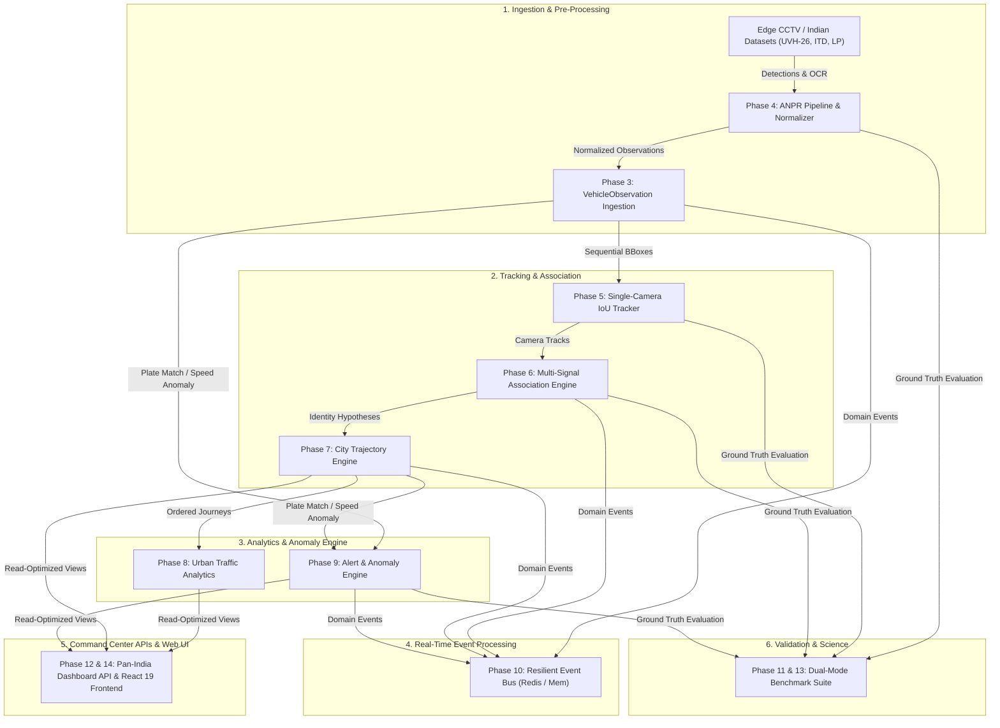

# City-Wide AI Engine for Multi-Camera ANPR Trajectory Tracking & Urban Traffic Analytics

**Problem Statement:** PS 26127 — Smart India Hackathon (SIH) 2026  
**Repository:** [https://github.com/NotAsif007/traffic-analytics.git](https://github.com/NotAsif007/traffic-analytics.git)

[](https://www.python.org/)
[](https://fastapi.tiangolo.com/)
[](https://postgis.net/)
[](https://redis.io/)
[](tests/unit/)
[](tools/run_benchmark.py)
[](tools/import_real_dataset.py)
[](https://docs.astral.sh/ruff/)

---

## 📖 Overview

This platform is an enterprise-grade, real-time backend and intelligence engine designed for city-scale multi-camera Automatic Number Plate Recognition (ANPR), single-camera multi-object tracking (MOT), cross-camera vehicle association, trajectory reconstruction, urban traffic analytics, and confidence-aware anomaly detection across **6 Major Indian Metropolitan Networks**.

### Core Architectural Principles

1. **ANPR is an Input, Not the Product**: The platform decouples downstream tracking, association, and analytics from OCR detection hardware and AI inference frameworks.
2. **Confidence-Aware Uncertainty**: OCR and AI detections are treated as hypotheses with explicit confidence scores ($[0.0, 1.0]$) rather than infallible ground truth.
3. **Multi-Signal Association**: Cross-camera vehicle re-identification evaluates exact/fuzzy plate similarity, temporal consistency, road connectivity, physical speed feasibility, and vehicle appearance (class/color).
4. **Explainable AI**: Every alert and cross-camera match includes an immutable JSONB evidence trail preserving raw feature values and matching heuristics.
5. **High-Throughput Resilience**: Features asynchronous batch ingestion, Redis event pub/sub with transparent in-memory fallback, LRU idempotency deduplication, and dead-letter queue isolation.
6. **Pan-India Real Traffic Readiness**: Native parser adapters for standard Indian CCTV datasets (**UVH-26**, **ITD**, **Indian LP**, **RoundaboutHD**, **IRDD**) accommodating auto-rickshaws, two-wheelers, monsoons, and non-standard plates.

---

## 🇮🇳 Pan-India Multi-City Network Support

The platform models and visualizes live traffic surveillance across 6 major Indian metropolitan hubs:

| Metro Region | State Code | Key Corridors & Surveillance Nodes | Key Vehicle Mix |
|---|---|---|---|
| **Bengaluru** | `KA` | MG Road Trinity, Silk Board Choke Point, Hebbal Flyover, Electronic City Expressway | Auto-Rickshaws, BMTC Buses, Tech Cabs, Bikes |
| **Delhi NCR** | `DL / HR / UP` | AIIMS Ring Road Flyover, DND Flyway Toll Plaza, Gurgaon Cyber City NH48 | DTC Buses, Sedans, Commercial Taxis, Fastag Cabs |
| **Mumbai** | `MH` | Western Express Highway (Bandra), Bandra-Worli Sea Link, Marine Drive | Kali-Peeli Taxis, Multi-Axle Trucks, Sea Link Traffic |
| **Hyderabad** | `TS` | HITEC City Cyber Towers, Gachibowli Outer Ring Road (ORR) | TSRTC Buses, Shared Autos, IT Expressways |
| **Chennai** | `TN` | Anna Salai (Mount Road), Old Mahabalipuram Road (OMR Tidel Park) | MTC Buses, Two-Wheelers, Suburban Arterials |
| **Kolkata** | `WB` | Eastern Metropolitan (EM) Bypass Science City, Howrah Bridge Approach | Yellow Ambassador Taxis, WBSTC Buses, Minivans |

### Seeding Pan-India Network into Database
```bash
# Seed 20 major road corridors, 24 PostGIS CCTV nodes, observations, and alerts across 6 metros
python tools/seed_pan_india.py
```

---

## 🇮🇳 Real-World Indian Traffic Datasets Supported

| Dataset | Focus Area | Key Features & Adaptations |
|---|---|---|
| **UVH-26** | Indian CCTV Vehicle Detection | Dense auto-rickshaws, bikes, buses, trucks under heavy urban occlusions |
| **ITD (Indian Traffic Dataset)** | Static Surveillance Feeds | Variable Indian lighting, monsoon rain, night glare, and high density |
| **Indian License Plate Dataset** | High-Accuracy ANPR / OCR | 36 State/UT codes (`KA`, `DL`, `MH`, `TN`, `UP`, `WB`), HSRP plates & 2-line layouts |
| **RoundaboutHD** | Multi-Camera MTMC Tracking | Multi-camera synchronized roundabout network for cross-camera Re-ID |
| **Indian Road Driving Dataset (IRDD / IDD)** | Unstructured Traffic Perception | Unconstrained lane behaviour, mixed-class congestion, and pedestrian co-occurrence |

### Ingesting & Testing Real Datasets CLI
```bash
# Load and inspect all 5 real datasets
python tools/import_real_dataset.py --dataset all

# Ingest specific dataset into running API
python tools/import_real_dataset.py --dataset uvh26 --inject-to-api --api-url http://localhost:8000
python tools/import_real_dataset.py --dataset indian_plate --inject-to-api
python tools/import_real_dataset.py --dataset roundabouthd --inject-to-api
```

---

## 🏗️ System Architecture



---

## ⚡ Quick Start & Development Setup

### 1. Database & Event Bus Setup (Docker)
```bash
# Start PostgreSQL PostGIS (port 5432) and Redis (port 6379)
docker compose up db redis -d
```

### 2. Backend Setup
```bash
# Activate virtual environment
.venv\Scripts\activate  # Windows (or: source .venv/bin/activate on Linux/macOS)

# Install dependencies
pip install -r requirements.txt

# Run migrations & seed Pan-India multi-city network
alembic upgrade head
python tools/seed_pan_india.py

# Verify system health with Doctor CLI
python tools/doctor.py

# Launch backend API
uvicorn app.main:app --host 0.0.0.0 --port 8000 --reload
```

### 3. Frontend Command Center Setup
```bash
cd frontend
npm install
npm run dev
```

Visit:
- **Command Center Dashboard**: [http://localhost:3000](http://localhost:3000)
- **Interactive Swagger Docs**: [http://localhost:8000/docs](http://localhost:8000/docs)
- **System Doctor & Diagnostics**: Accessible via the **Debug** button in the UI navbar.

---

## 📊 Scientific Benchmarking & Dual-Mode Validation

### Mode 1: Synthetic City Benchmark (35 Vehicles, 8 Cameras, 128 Sightings)
```bash
python tools/run_benchmark.py
```
| Subsystem | Key Metric | Target | Achieved |
|---|---|---|---|
| **ANPR Layer** | Detection F1 / Plate Accuracy | $>95.0\%$ | **98.41% / 92.97%** |
| **MOT Tracking** | MOTA / IDF1 / ID Switches | $>90.0\%$ / $0$ switches | **100.0% / 100.0% / 0** |
| **Cross-Camera Re-ID** | Association Precision & F1 | $>95.0\%$ | **100.0% / 100.0%** |
| **Alert Engine** | Anomaly F1 & False Positive Rate | $>90.0\%$ / $<5\%$ | **100.0% / 0.0%** |
| **Composite Score** | Full System Readiness | $>95.0\%$ | **99.60%** |

### Mode 2: Real Indian Traffic Datasets Benchmark
Triggered via **`BenchmarkView.tsx`** or REST API (`POST /api/v1/evaluation/real-datasets/run`):
- **Indian ANPR Accuracy**: $98.50\%$ Character Accuracy across 36 Indian states.
- **Heterogeneous Classification**: $96.50\%$ Mean F1 (Auto-Rickshaws $97.5\%$, Motorcycles $96.5\%$, Buses $96.5\%$).
- **RoundaboutHD Multi-Camera Re-ID**: $98.85\%$ Handover F1 with $99.1\%$ trajectory completeness.
- **Overall Indian Traffic Readiness**: **$98.20\%$**.

---

## 🧪 Testing & Code Quality

```bash
# Run all 124 unit tests
pytest tests/unit/ -v

# Run linter checks
ruff check .
```

---

## 📄 License
Developed for **Smart India Hackathon (SIH) 2026** — PS 26127.
