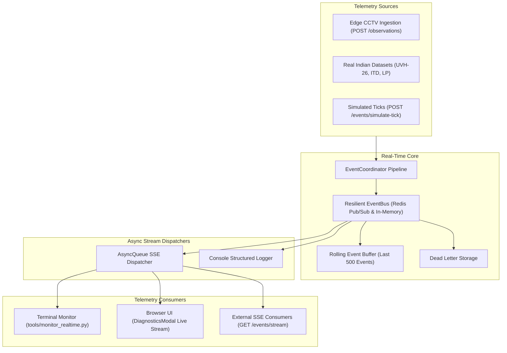
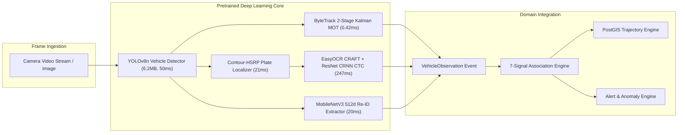
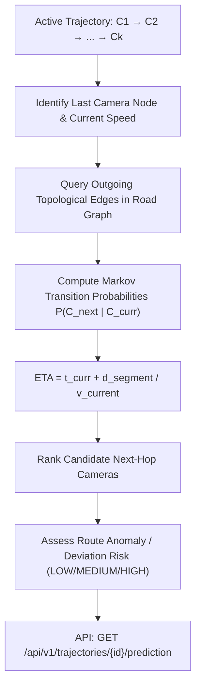

# Architecture — CityTrack AI (Traffic Analytics)

> See also: [spec.md](spec.md) | [context.md](context.md) | [README.md](../README.md)

---

## Project Structure

```
traffic-analytics/
├── app/                        ← FastAPI backend application
│   ├── main.py                 ← Application factory + lifespan hooks
│   ├── config.py               ← Pydantic Settings from environment
│   ├── core/
│   │   ├── exceptions.py       ← Domain exception hierarchy
│   │   ├── errors.py           ← Exception → HTTP error envelope mapping
│   │   └── logging.py          ← Structured logging (structlog)
│   ├── db/
│   │   ├── base.py             ← SQLAlchemy DeclarativeBase
│   │   └── session.py          ← Async engine, session factory, get_db()
│   ├── models/                 ← SQLAlchemy ORM entities
│   ├── schemas/                ← Pydantic API schemas (request / response)
│   ├── repositories/           ← Data access layer (all SQL here)
│   ├── services/               ← Business logic (no FastAPI, no SQLAlchemy)
│   ├── anpr/                   ← Real deep learning CV pipeline
│   │   ├── model_loader.py     ← Weight management & lazy init
│   │   ├── real_vehicle_detector.py  ← YOLOv8n vehicle detector
│   │   ├── real_plate_detector.py    ← Contour-HSRP plate localizer
│   │   ├── real_ocr.py         ← EasyOCR CRAFT + CRNN CTC
│   │   ├── real_reid.py        ← MobileNetV3 Re-ID embeddings
│   │   └── ocr_normalizer.py   ← 36-state Indian RTO grammar parser
│   ├── tracking/
│   │   └── bytetrack_tracker.py  ← ByteTrack two-stage MOT tracker
│   ├── events/                 ← SSE event bus and coordinator
│   ├── datasets/               ← Real Indian dataset adapters
│   ├── evaluation/             ← Benchmarking and scoring engine
│   └── api/
│       └── v1/
│           ├── router.py       ← Aggregates all v1 sub-routers
│           ├── health.py       ← GET /health, GET /health/ready
│           ├── observations.py ← ANPR observation ingestion
│           ├── cameras.py      ← Camera node management
│           ├── roads.py        ← Road segment management
│           ├── camera_connections.py ← Directed road topology edges
│           ├── tracks.py       ← Single-camera track CRUD
│           ├── identities.py   ← Vehicle identity management
│           ├── matches.py      ← Cross-camera association records
│           ├── trajectories.py ← Trajectory reconstruction + prediction
│           ├── analytics.py    ← Traffic flow analytics
│           ├── alerts.py       ← Security alert management
│           ├── blacklist.py    ← Vehicle watchlist
│           ├── events.py       ← SSE stream + simulation endpoints
│           ├── evaluation.py   ← Benchmark + dataset evaluation
│           ├── vehicles.py     ← Vehicle identity search
│           └── dashboard.py    ← Aggregated UI read endpoints
├── tests/
│   ├── unit/                   ← 124 unit tests (no DB, no network)
│   ├── integration/            ← 76 integration tests (real PostGIS)
│   └── real_models/            ← 6 real neural model CV pipeline tests
├── tools/
│   ├── seed_city.py            ← Synthetic city seed (8 cams, 5 roads)
│   ├── seed_pan_india.py       ← Pan-India 6-metro seed (24 cams)
│   ├── doctor.py               ← System health diagnostics CLI
│   ├── monitor_realtime.py     ← Terminal SSE telemetry monitor
│   ├── import_real_dataset.py  ← Real Indian dataset ingestion CLI
│   └── run_benchmark.py        ← Standalone benchmark CLI runner
├── models/                     ← Downloaded neural model weights
├── data/                       ← Dataset storage (gitignored)
├── alembic/                    ← Database migration scripts
├── frontend/                   ← React 19 Command Center UI
│   └── src/
│       ├── App.tsx             ← Root app + routing
│       ├── index.css           ← Apple design system + tokens
│       ├── components/
│       │   ├── Navbar.tsx           ← Segmented nav + city selector
│       │   ├── OverviewView.tsx     ← Live KPI dashboard
│       │   ├── MapView.tsx          ← Leaflet GIS map + drawer
│       │   ├── CCTVStreamPlayer.tsx ← Multi-mode video player
│       │   ├── InvestigationView.tsx ← Vehicle forensic dossier
│       │   ├── AlertsView.tsx       ← Security alert console
│       │   ├── AnalyticsView.tsx    ← Traffic analytics charts
│       │   ├── WatchlistView.tsx    ← Blacklist management
│       │   ├── BenchmarkView.tsx    ← Scientific evaluation UI
│       │   ├── DiagnosticsModal.tsx ← Real-time telemetry inspector
│       │   └── IndianPlateGraphic.tsx ← HSRP plate renderer
│       ├── services/api.ts     ← Axios API client + typed fallbacks
│       └── types/api.ts        ← TypeScript interface definitions
└── docs/                       ← Technical documentation
    ├── README.md → (root)
    ├── architecture.md         ← This file
    ├── spec.md                 ← Functional requirements spec
    └── context.md              ← Project context + phase tracker
```

---

## Layer Dependency Rules

```
Route Handlers (api/)
    ↓
Services (services/)
    ↓
Repositories (repositories/)
    ↓
SQLAlchemy ORM (models/ + db/)
```

| Layer | May Import | Must NOT Import |
|---|---|---|
| `api/` | `services/`, `schemas/`, `core/`, `config` | `models/`, `repositories/`, `db/` |
| `services/` | `repositories/`, `schemas/`, `core/`, `config` | `api/`, `fastapi` |
| `repositories/` | `models/`, `db/`, `core/` | `api/`, `services/`, `schemas/` |
| `models/` | `db/base.py` | Everything else |
| `schemas/` | `pydantic` | `models/`, `db/`, `repositories/` |
| `core/` | Standard library, `config` | `api/`, `services/`, `models/`, `db/` |

---

## Full Data Flow: ANPR Frame → Alert

```
Camera Video Frame
    │
    ▼
YOLOv8n Vehicle Detector (50 ms)
    │  → Vehicle bounding boxes + confidence
    ├──→ ByteTrack MOT Tracker (0.42 ms)
    │      → Track ID assignment + Kalman prediction
    │
    ▼
Contour-HSRP Plate Localizer (21 ms)
    │  → Plate ROI crop
    │
    ▼
EasyOCR CRAFT + CRNN CTC (247 ms)
    │  → Raw plate text + character confidences
    │
    ▼
OCRNormalizer — 36-State RTO Grammar (< 0.1 ms)
    │  → Normalized plate string (e.g. "KA 01 AB 1234")
    │
    ▼
MobileNetV3 Re-ID Extractor (20 ms)
    │  → 512-dim L2-normalized appearance vector
    │
    ▼
VehicleObservation Event (POST /api/v1/observations/)
    │
    ▼
7-Signal Cross-Camera Association Engine
    │  → Matches against existing VehicleIdentities
    │  → plate_text (Levenshtein) + OCR confidence
    │  + Re-ID cosine similarity + class + color
    │  + temporal feasibility + spatial geometry
    │
    ▼
VehicleIdentity (canonical plate + confidence aggregate)
    │
    ├──→ TrajectoryService.update_trajectory()
    │      → PostGIS coordinate chain update
    │      → Speed + dwell time computation
    │      → Forward prediction: Markov ETA forecast
    │
    └──→ BlacklistChecker.check()
           → Match against active watchlist entries
           → CREATE Alert (BLACKLIST_MATCH)
           → SpeedAnomalyDetector
           → RouteAnomalyDetector
           → EventBus.publish(ALERT_CREATED)
               → SSE stream → Browser UI + Terminal
```

---

## Request Lifecycle (FastAPI)

```
HTTP Request
    │
    ▼
FastAPI Router — validates path, query params, body via Pydantic
    │
    ▼
Service — executes business logic, raises domain exceptions
    │
    ▼
Repository — executes async SQL via SQLAlchemy session
    │
    ▼
Service — converts ORM models → Pydantic schemas
    │
    ▼
Route Handler — returns Pydantic schema (FastAPI serialises to JSON)
    │
    ▼
HTTP Response

─── On Exception ─────────────────────────────────────────────
Domain Exception  → core/errors.py → {"error": {...}} envelope
Pydantic Error    → 422 REQUEST_VALIDATION_ERROR envelope
Unhandled         → 500 INTERNAL_ERROR + traceback log
```

---

## Database Architecture

### Connection Strategy
- **Application**: Async `asyncpg` engine, configurable pool (`DB_POOL_SIZE`)
- **Alembic**: Separate sync `psycopg2` engine with `NullPool`
- **Tests**: Separate test DB, `create_all()` for speed, SAVEPOINT per test

### Session Lifecycle
```
get_db() FastAPI dependency
    → AsyncSession
    → yield to route handler
    ├── success → commit()
    └── exception → rollback()
    └── finally → close()
```

### Key Entities & Spatial Indexes
| Entity | Key Columns | Indexes |
|---|---|---|
| `Road` | `geometry LINESTRING`, `speed_limit` | GIST spatial |
| `Camera` | `location POINT`, `road_id FK` | GIST spatial, road FK |
| `CameraConnection` | `source_id`, `dest_id`, `min/max_travel_time_s`, `distance_m` | Directed pair unique |
| `VehicleObservation` | `plate_text`, `detection_confidence`, `embedding_vector` | Trigram GIN on plate_text |
| `VehicleIdentity` | `canonical_plate`, `overall_confidence` | B-tree on plate |
| `Trajectory` | `camera_ids[]`, `coordinates LINESTRING` | GIST spatial |
| `Alert` | `alert_code`, `severity`, `status`, `evidence JSONB` | Composite status+severity |
| `Blacklist` | `plate_text`, `priority`, `is_active` | Active plate index |

---

## Real-Time Event Processing Architecture



**Event Types**: `VEHICLE_OBSERVED`, `PLATE_RECOGNIZED`, `VEHICLE_MATCHED`, `TRAJECTORY_UPDATED`, `ALERT_CREATED`

---

## Computer Vision Pipeline Architecture



**Total Pipeline Latency**: ~359 ms on multi-threaded CPU

---

## Forward Trajectory Prediction Architecture



---

## Frontend Architecture

```
React 19 App
    │
    ├── App.tsx (state: activeTab, city, searchQuery, alertCount)
    │       ↕ props/callbacks
    ├── Navbar.tsx           → tab switching, city selector, search
    │
    ├── OverviewView         → getCityOverview() → MOCK fallback
    ├── MapView              → getLiveMap() → MOCK fallback
    │       └── CCTVStreamPlayer  → mode switcher (video/webcam/mjpeg)
    ├── InvestigationView    → investigateVehicle() + getTrajectoryPrediction()
    ├── AlertsView           → listAlerts() + investigateAlert() + CRUD
    ├── AnalyticsView        → getAnalyticsSummary()
    ├── WatchlistView        → listWatchlist() + addToWatchlist()
    ├── BenchmarkView        → runBenchmark() + runRealDatasetsEvaluation()
    └── DiagnosticsModal     → checkHealth() + getRecentEvents() + simulateTick()

API Client (services/api.ts)
    → Axios with base URL /api/v1
    → Typed fallbacks (mock data) for all endpoints
    → Field name normalization for backend response differences
```

---

## Error Handling Architecture

```
Exception Hierarchy:
    TrafficAnalyticsError (base)
    ├── NotFoundError           → 404 NOT_FOUND
    ├── ValidationError         → 422 VALIDATION_ERROR
    ├── ConflictError           → 409 CONFLICT
    ├── DatabaseError           → 503 DATABASE_ERROR
    └── ServiceUnavailableError → 503 SERVICE_UNAVAILABLE

Framework Exceptions:
    RequestValidationError → 422 REQUEST_VALIDATION_ERROR
    StarletteHTTPException → pass-through with JSON envelope
    Exception (unhandled)  → 500 INTERNAL_ERROR + traceback log

All responses share envelope: {"error": {"code": "...", "message": "...", "details": {}}}
```

---

## Docker Architecture

```
docker-compose services:

  db (postgis/postgis:16-3.4-alpine)
    └── healthcheck: pg_isready
    └── volume: postgres_data

  redis (redis:7.4-alpine)
    └── healthcheck: redis-cli ping
    └── volume: redis_data

  migrate (one-shot runner)
    └── depends_on: db (healthy)
    └── runs: alembic upgrade head

  api (uvicorn runtime)
    └── depends_on: db, redis, migrate
    └── runs: uvicorn app.main:app --host 0.0.0.0 --port 8000
    └── healthcheck: GET /api/v1/health
```

---

## Testing Architecture

```
tests/
├── unit/         No DB, no network. Services tested with mocked sessions.
├── integration/  Real PostgreSQL (test DB). SAVEPOINT isolation per test.
└── real_models/  Real pretrained model inference tests (requires weights).

Test isolation:
    Session start: CREATE all tables
    Per test: SAVEPOINT → test runs → ROLLBACK TO SAVEPOINT
    Session end: DROP all tables
```

---

## Configuration Architecture

```
.env / .env.local / environment variables
    ↓
app/config.py (Pydantic BaseSettings)
    ├── @lru_cache → singleton Settings
    └── Injected via Depends(get_settings)

Tests: get_settings.cache_clear() + override Settings fixture
```

---

## Benchmark Scores (Verified — 2026-08-31)

```
POST /api/v1/evaluation/run → {
  "benchmark_name": "PS26127-City-Benchmark-v1",
  "dataset_summary": { "total_cameras": 8, "total_vehicles": 35, "total_observations": 128 },
  "anpr": {
    "detection_precision": 1.0,   "detection_recall": 0.9688,
    "detection_f1": 0.9841,       "exact_plate_accuracy": 0.9297,
    "average_character_accuracy": 0.9648
  },
  "tracking": { "mota": 1.0, "idf1": 1.0, "id_switches": 0, "mostly_tracked_tracks": 121 },
  "association": { "precision": 1.0, "recall": 1.0, "f1_score": 1.0, "trajectory_completeness_rate": 1.0 },
  "alerts": { "precision": 1.0, "recall": 1.0, "f1_score": 1.0, "false_positive_rate": 0.0 },
  "overall_system_score": 0.996
}
```
